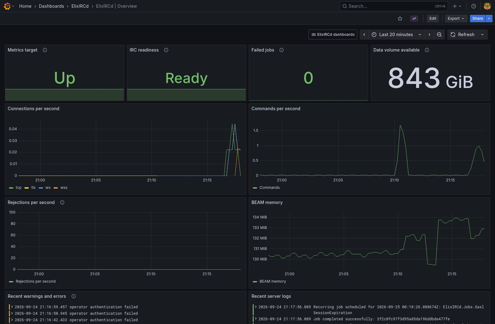
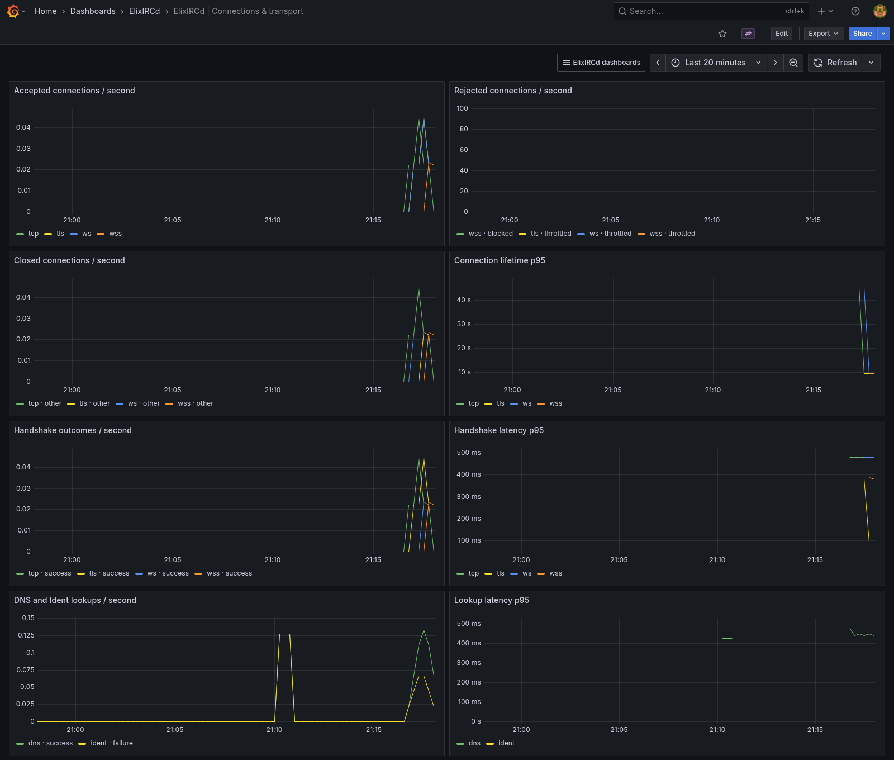
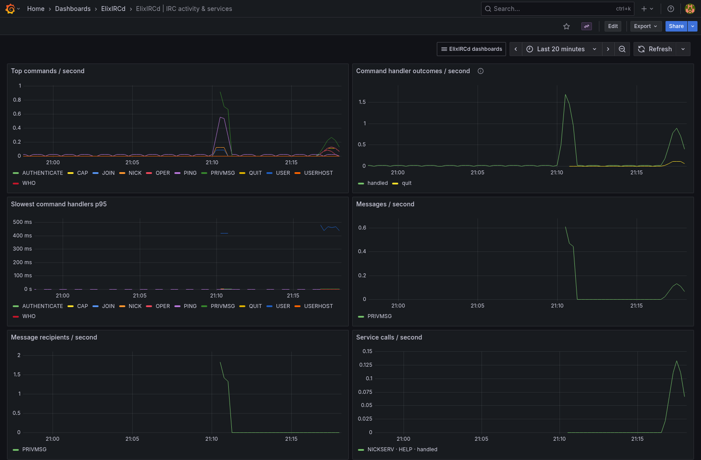
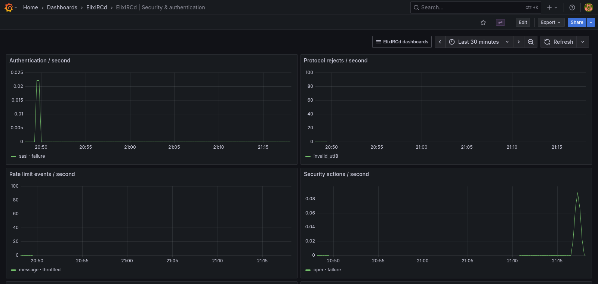
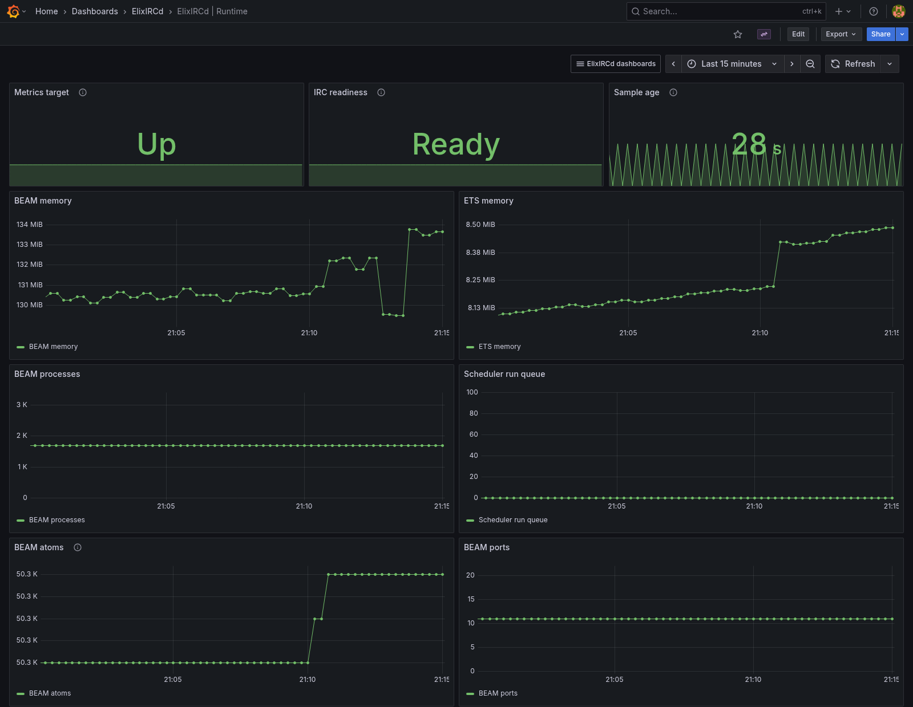
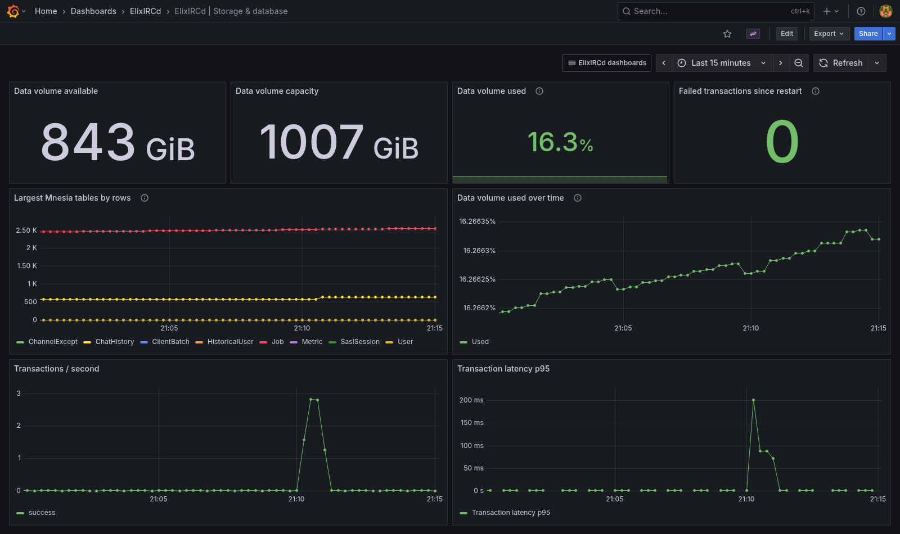
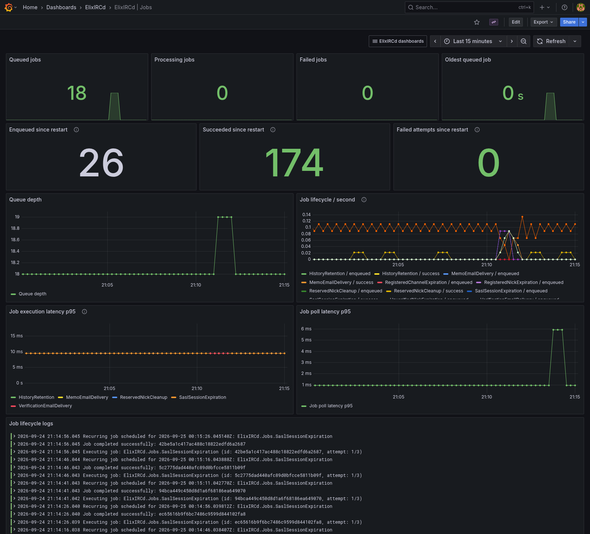
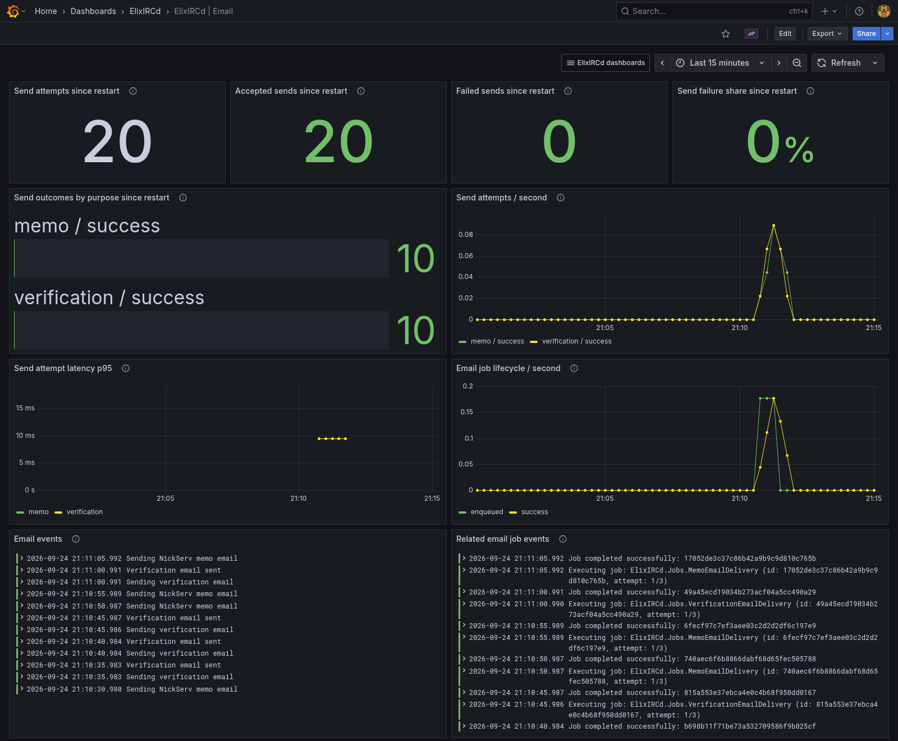
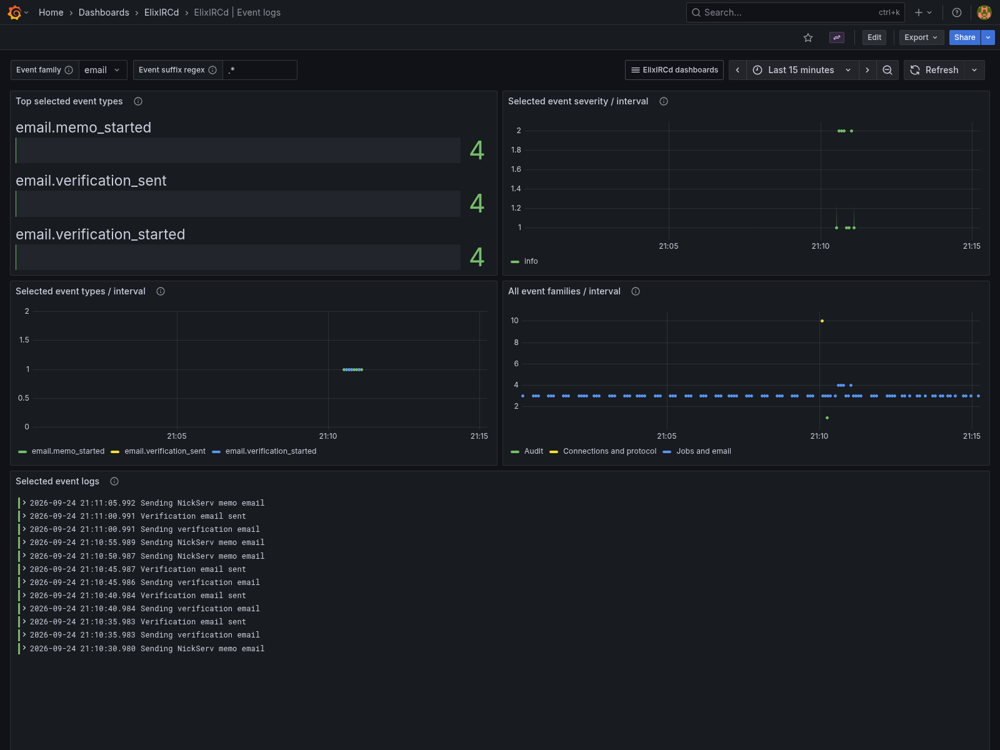
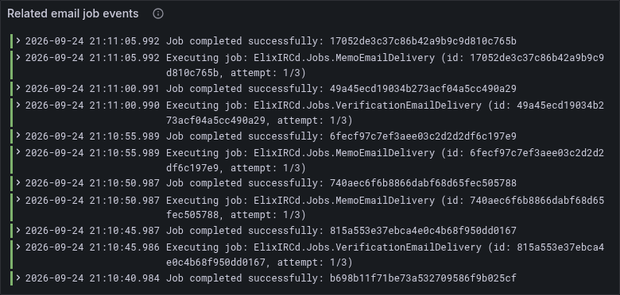

# Self-hosted observability

This optional stack runs ElixIRCd with Prometheus (metrics and alert rules), Grafana (dashboards), Loki (log storage), and Alloy (Docker log collection). It does not send telemetry to a third party.

## Start

Use an ElixIRCd image built from this revision or a later release. To test a local build:

```sh
docker build -t elixircd:observability .
export ELIXIRCD_IMAGE=elixircd:observability
export GRAFANA_ADMIN_PASSWORD='choose-a-long-unique-password'
docker compose -f observability/compose.yaml up -d
```

Open <http://127.0.0.1:3000> and sign in as `admin` with the password above. The `ElixIRCd` folder contains nine English dashboards: Overview, Connections & transport, IRC activity & services, Security & authentication, Runtime, Storage & database, Jobs, Email, and Event logs. The dashboard navigation menu preserves the selected time range. Prometheus scrapes the private `elixircd:9568/metrics` address. Loki receives JSON container logs via Alloy. `docker compose -f observability/compose.yaml ps` shows container state; `docker compose -f observability/compose.yaml logs elixircd alloy` helps diagnose startup.

The Event logs dashboard has an **Event family** dropdown and an **Event suffix regex** input. Use the default `.*` suffix to see all names in a family, or enter `failed|crashed` to narrow the selected family. The top event types, severity trend, per-type trend, and selected log stream follow these filters; the family trend and "Other runtime logs" remain unfiltered for context. Families use the stable prefix of `metadata.event`: `audit.*`, `authentication.*`, `connection.*`/`protocol.*`, `job.*`/`email.*`, `account.*`/`channel.*`/`service.*`, and `observability.*`. Click a log line for its JSON fields, including bounded `job_type`, `result`, and `connection_id` when available. For ad hoc investigation, use Grafana Explore with the Loki query `{service="elixircd"} | json`; for example, append `| metadata_event=~"^job[.].+"` to select job events. Job lifecycle logs include enqueue, start, completion, retry, failure, cancellation, and recovery. Event names are parsed at query time rather than indexed as Loki labels.

## Dashboard screenshots

These captures come from the local Docker stack during synthetic IRC traffic with multiple clients over TCP, TLS, WebSocket, and secure WebSocket, plus local email jobs sent through the test adapter. They show measured traffic, storage activity, jobs, audit events, and controlled rejects; they are examples rather than production measurements. Dashboard log panels display the message text, while the structured JSON fields remain available in each log entry's details. Live values and panels with no matching events will vary.

### Overview

Health, traffic, memory, and recent logs in one view.



### Connections and transport

Connection acceptance and rejection, disconnects, handshakes, and transport-specific activity.



### IRC activity and services

Command rates and latency, message delivery, and NickServ/ChanServ calls.



### Security and authentication

Authentication results, protocol rejects, rate limiting, and administrative security actions.



### Runtime

Metrics availability, IRC readiness, sample freshness, and BEAM resource trends.



### Storage and database

Data volume capacity and usage, Mnesia table sizes, and transaction throughput and latency.



### Jobs

Queue state, enqueue and execution outcomes, and execution latency. The p95 execution chart excludes enqueue events with zero duration.



### Email

Send attempts and adapter outcomes by purpose, failure share, latency, related queue jobs, and logs. An accepted send means the configured mail adapter returned success; recipient inbox delivery is not measured.



### Event logs

Event type counts and severity over time, with filters for structured event family and suffix. The example selects the email family; the companion excerpt shows related email job lifecycle messages from the same run.





This Compose file owns the usual IRC ports (6667, 6697, 8080, 8443) and Grafana's loopback port 3000. Adjust host port mappings if occupied. Add your IRC configuration or TLS certificates by mounting them into `/app/config/elixircd.exs` and `/app/data/cert` as described in the root README. Preserve the `elixircd-data` volume. A fresh volume starts with a fresh Mnesia schema; existing deployments must use their own compatible data volume and backup before changing versions.

## Endpoints and data

- `GET /health/live`: management HTTP server responds; this does not imply IRC readiness.
- `GET /health/ready`: Mnesia tables, rate limiter, nick enforcement, job queue, and configured listeners are running; returns 503 with a bounded reason otherwise.
- `GET /metrics`: Prometheus exposition for connections, traffic, commands, rejects, rate limits, authentication, services, messages, history, jobs, mail, configuration reloads, BEAM memory/processes, Mnesia table sizes, readiness, and data-volume capacity.

By default, `observability.enabled` is `true` and management HTTP binds only `127.0.0.1:9568`. Set it to `false` in the mounted `config/elixircd.exs` to skip the metrics reporter, periodic sampler, and management listener; normal server logs still run. This monitoring Compose example needs `enabled: true` to collect metrics. It sets `ELIXIRCD_OBSERVABILITY_BIND=0.0.0.0` so Prometheus can reach the endpoint over the private Compose network; it does **not** publish port 9568 on the host. Restrict Docker network access if other services share that network. Changes to enabled, port, or bind address take effect on restart, not REHASH. If you change the port in a mounted config, update the Prometheus target.

Metric labels come from finite enums such as transport, command, result, service, and job type. They do not contain nicknames, IP addresses, channel names, message bodies, passwords, emails, or connection IDs. Commands are measured by their top-level handler completion, so `handled` does not claim an IRC command succeeded semantically. TCP/TLS outgoing bytes are counted after a successful socket send; WebSocket outgoing bytes are counted when queued, under a separate metric. Counter samples are process-local and reset on restart. Gauges sample every 30 seconds; jobs every 60 seconds. The data-volume disk gauge reports zero if the OS cannot resolve its mount.

Production logs use JSON. Normal connection logs use a random, per-connection ID; the permitted metadata fields are listed in `config/prod.exs`. Administrative audit logs for OPER, REHASH, RESTART, and DIE may contain an operator account or nick in the `actor` field. Treat Loki, Grafana, and Docker logs as restricted operational data. IRC contents are not intentionally logged. If an unexpected exception includes sensitive values in its text, the runtime may still log that exception; review custom integrations and retention accordingly.

## Retention, access, and alerts

Prometheus retains metrics for 15 days. Loki retains logs for 7 days. Docker rotates the IRC server's container log at five 10 MB files. Named volumes persist on `docker compose down`; `docker compose down -v` deletes monitoring and IRC data. Back up the volumes if the history matters. The stack does not configure an Alertmanager notification destination: alert rules show in Prometheus/Grafana, and you can add a receiver for paging. Included alerts cover down/unready, stale samples, low disk space, old queued jobs, and failed jobs.

Grafana is bound to the host loopback and requires `GRAFANA_ADMIN_PASSWORD`. For remote access, put an authenticated HTTPS reverse proxy in front of it or use a private tunnel. The Alloy container mounts the Docker socket read-only to discover the ElixIRCd container, but Docker socket access is privileged even with a read-only mount. Run this stack only on a host you trust or replace Docker discovery with another log collector. Prometheus and Loki are internal to the Compose network and have no host ports.

To inspect metrics without the full stack, run the image with a private Docker network and scrape port 9568 from another container on that network. The production image exposes the same endpoints when observability is enabled. Neither the image nor this Compose example ties Docker container health to the optional management HTTP endpoint; the Runtime dashboard and Prometheus alerts report metrics availability and IRC readiness separately.
